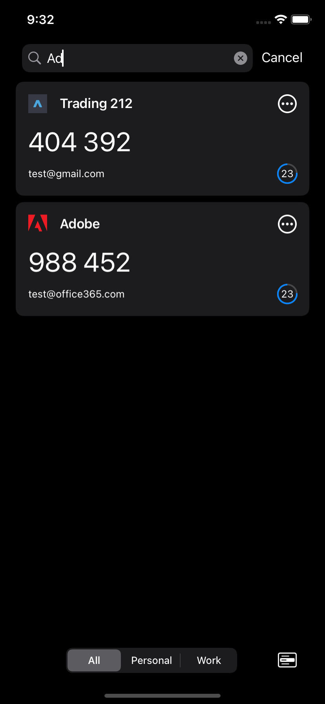
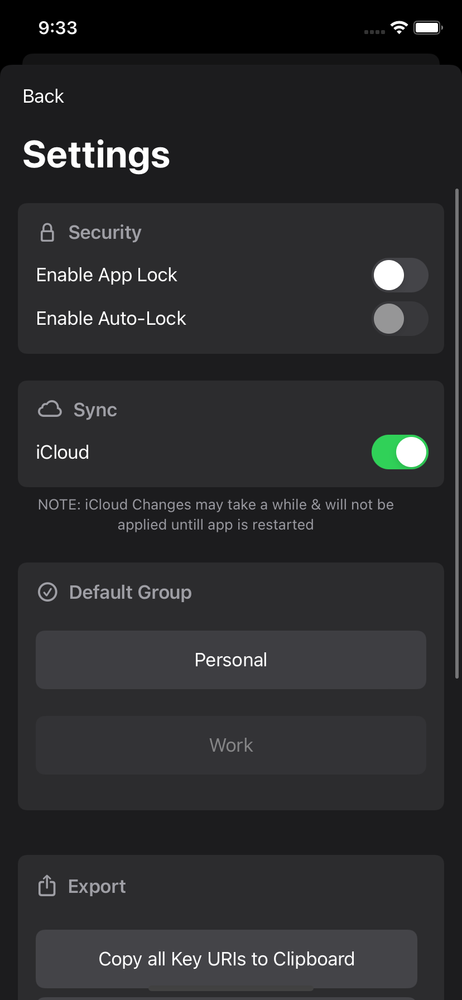
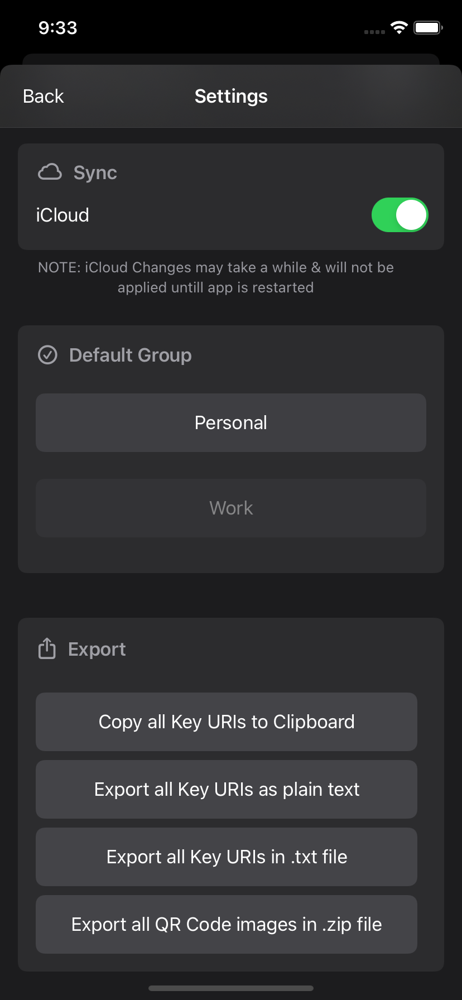

II Factor
======

II Factor is a TOTP open source fork from 2FA Auth for iOS & macOS.

The project was forked to support token groups, for organising the tokens of your personal and work life.
It also adds the optional convenience of iCloud backup/syncing as well as cosmetic changes.

II Factor give you FULL control over YOUR keys. That means allowing you to keep your keys offline, or allowing you to view, export or import your keys via a plethera of methods.

# Screenshots
### iOS
 
 
 

### macOS
 
 

## Third-party Libraries
- [SwiftOTP](https://github.com/lachlanbell/SwiftOTP)
